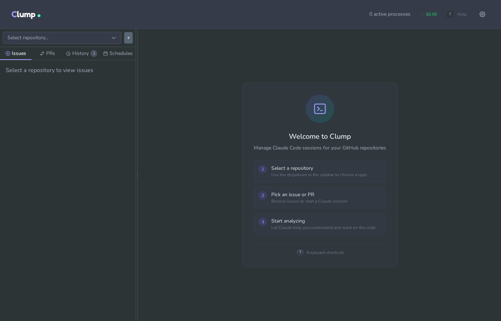
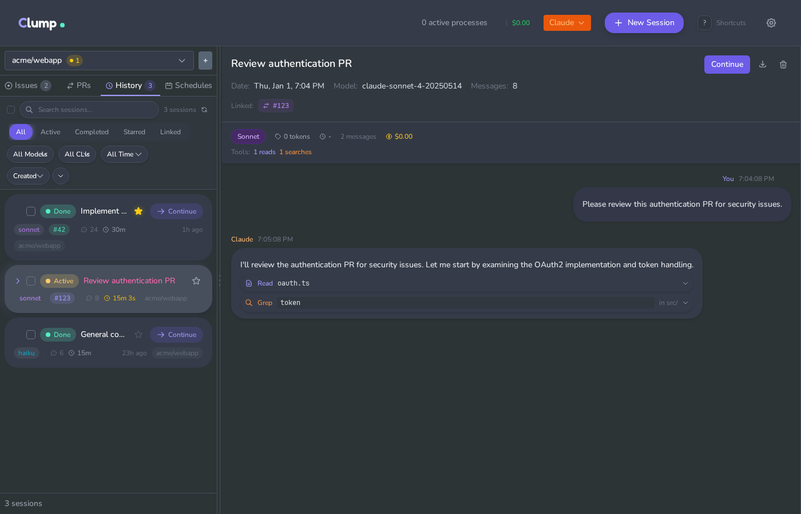
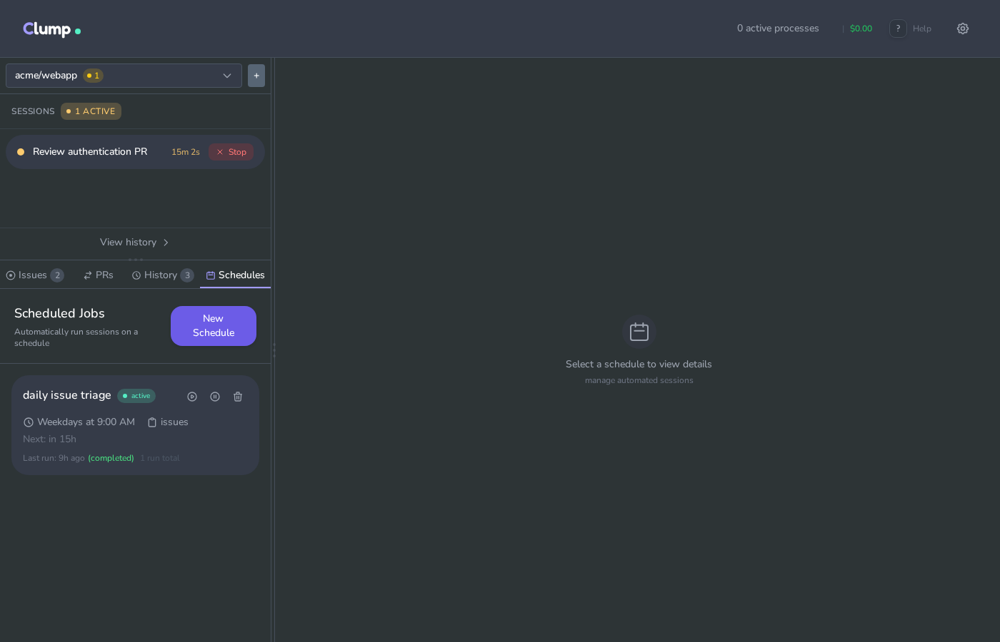
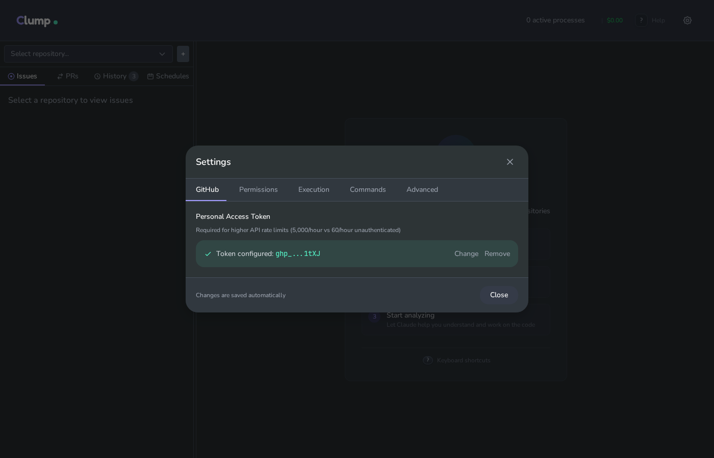
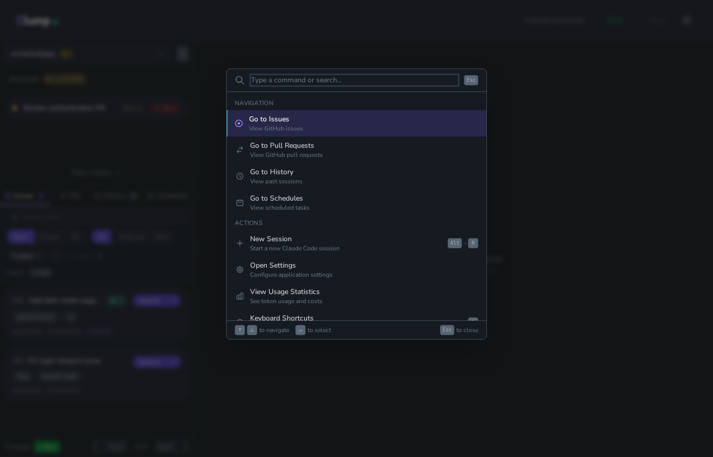

# Clump

Web UI for running AI coding assistants against GitHub issues and PRs.

## Motivation

AI coding CLIs run in terminals. GitHub issues and PRs live in browsers. Working on GitHub repos with these tools means switching between the two and manually providing context.

Clump embeds AI coding terminals in a web UI alongside GitHub data. It fetches issues and PRs via the GitHub API, spawns CLI processes, and saves transcripts to disk. Sessions are linked to the issues or PRs they analyze, so you can see what analyses have been run on a given issue. You can run multiple sessions in parallel across tabs, browse session history, and search past transcripts. A scheduler handles cron-based recurring runs.

## Supported CLIs

Clump supports multiple AI coding assistants through a unified adapter system:

- **Claude Code** - Anthropic's CLI for Claude (default)
- **Gemini CLI** - Google's Gemini CLI
- **Codex CLI** - OpenAI's Codex CLI

Each CLI has different capabilities. Clump detects what's installed and shows available options. You can switch between CLIs when starting new sessions.

## What it does

- Browse GitHub issues and PRs with their comment threads
- Run AI coding sessions in embedded terminals (Claude, Gemini, or Codex)
- Keep multiple sessions open in tabs
- Save transcripts and search past sessions
- AI-generated issue metadata (priority, difficulty, risk, type, status, tags)
- Filter issues by metadata properties in the UI and scheduled jobs
- Schedule recurring analyses with cron expressions and metadata filters
- Track token usage and estimated costs

## Screenshots

### Welcome Screen
Get started by selecting a repository from the dropdown. The welcome screen shows available repos and quick actions.



### Issues View
Browse and analyze GitHub issues with full comment threads. Each issue shows related sessions and quick-action buttons.


### Pull Requests
Review PRs with diff stats, branch info, and comments. Start code review sessions directly from the UI.


### Active Sessions
Running sessions appear in the sidebar. Click to view the terminal output and interact with Claude Code.



### Session History
Search and filter past Claude Code sessions. View transcripts with tool usage, costs, and linked issues/PRs.


### Schedules
Set up recurring analyses with cron expressions. Track last run status and next scheduled execution.



### Settings
Configure Claude Code behavior: permission mode, allowed tools, model selection, and more.



### Command Palette
Quick access to all actions with `Ctrl+K`. Jump to issues, PRs, sessions, or run commands.



## Requirements

- Python 3.11+
- Node.js 18+
- At least one supported CLI installed and authenticated:
  - Claude Code (`claude` command)
  - Gemini CLI (`gemini` command)
  - Codex CLI (`codex` command)
- GitHub personal access token

## Setup

```bash
git clone https://github.com/anthropics/clump.git
cd clump
./run.sh
```

Open http://localhost:5173

## Usage

1. Add a repository (owner/name + local path)
2. Browse issues or PRs
3. Click "Analyze" to start a Claude Code session
4. Type in the terminal
5. Open more tabs for parallel sessions
6. Search past sessions in the Analyses tab

## Data storage

Everything lives in `~/.clump/`:

```
~/.clump/
├── repos.json                        # Repository list
└── projects/{hash}/
    ├── data.db                       # SQLite (sessions, tags, schedules)
    └── sessions/{id}/transcript.jsonl
```

Each repo gets its own database.

## Configuration

`backend/.env`:

```bash
# GitHub token
GITHUB_TOKEN=ghp_...

# CLI command paths (defaults shown, override if needed)
CLAUDE_COMMAND=claude
GEMINI_COMMAND=gemini
CODEX_COMMAND=codex

# Claude Code settings
CLAUDE_PERMISSION_MODE=acceptEdits
CLAUDE_ALLOWED_TOOLS=Read,Glob,Grep,Bash(git:*)
CLAUDE_MAX_TURNS=10
CLAUDE_MODEL=sonnet
```

## Architecture

```
Browser (React + xterm.js)
    │
    │ HTTP + WebSocket
    ▼
FastAPI backend
    ├── GitHub API proxy
    ├── CLI adapter system (Claude, Gemini, Codex)
    ├── PTY manager (spawns CLI processes)
    ├── Transcript parser (JSONL → structured data)
    ├── Sidecar metadata (AI-generated issue analysis)
    ├── Scheduler (cron jobs with metadata filters)
    └── SQLite per repo
```

## API

### Repos & GitHub
- `GET/POST /api/repos` - List/add repos
- `GET /api/repos/:id/issues` - List issues
- `GET /api/repos/:id/issues/:num` - Issue with comments
- `GET /api/repos/:id/pulls` - List PRs

### Sessions
- `POST /api/sessions` - Start terminal session
- `GET /api/sessions` - List active sessions
- `DELETE /api/sessions/:id` - Kill session
- `WS /api/sessions/:id/ws` - Terminal I/O

### Headless (non-interactive)
- `POST /api/headless/run` - Run and wait for result
- `POST /api/headless/run/stream` - Stream NDJSON output

### Saved analyses
- `GET /api/analyses` - Search past sessions
- `GET /api/analyses/:id` - Get transcript and metadata
- `PATCH /api/analyses/:id` - Update summary/tags

### Schedules
- `GET/POST /api/schedules` - Manage cron jobs
- `POST /api/schedules/:id/run` - Trigger manually

### CLIs
- `GET /api/cli/available` - List installed CLIs and capabilities

### Other
- `GET /api/stats` - Usage analytics
- `GET /api/tags` - Tag management
- `GET /api/commands` - Available slash commands

## Issue Sidecar Metadata

When you analyze an issue, Clump stores AI-generated metadata in `.clump/issues/{number}.json`:

- **priority**: critical, high, medium, low
- **difficulty**: trivial, easy, medium, hard, complex
- **risk**: low, medium, high
- **type**: bug, feature, refactor, docs, chore, question
- **status**: open, in_progress, completed, wontfix
- **affected_areas**: list of codebase areas
- **tags**: custom labels

This metadata powers filtering in the issue list and scheduled job targeting. For example, a scheduled job can use `priority:high,critical -type:docs` to only process high-priority non-documentation issues.

## CLI-specific flags

Each CLI adapter translates Clump settings to CLI-specific flags:

**Claude Code:**
- `--allowedTools` / `--permission-mode` - Permissions
- `--session-id` / `--resume` - Continue conversations
- `-p` - Headless mode with JSON output
- `--max-turns` - Limit execution depth
- `--model` - Model selection

**Gemini CLI / Codex CLI:**
- Adapters map equivalent functionality where available
- Not all features are supported by all CLIs
