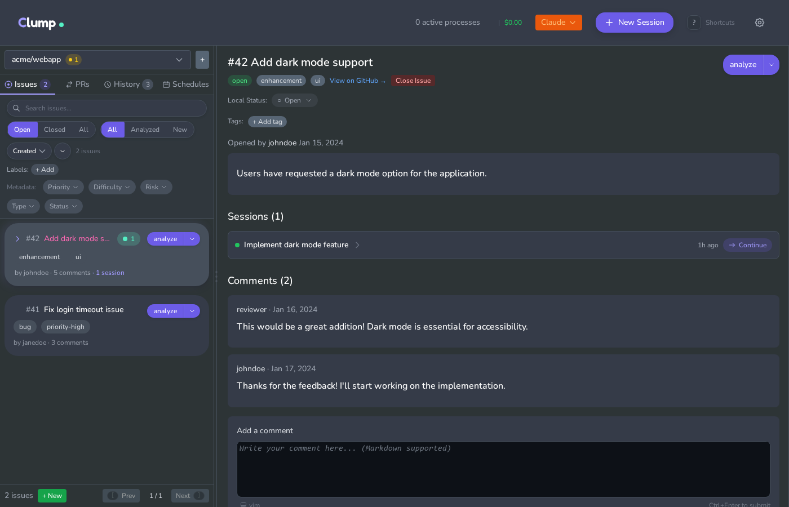
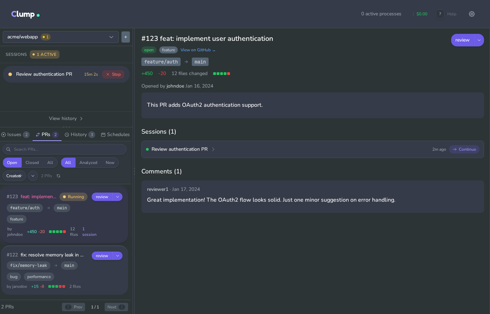

# Clump

Web UI for running multiple Claude Code sessions against GitHub issues and PRs.

## Motivation

Claude Code runs in a terminal. GitHub issues and PRs live in a browser. Working on GitHub repos with Claude Code means switching between the two and manually providing context.

Clump embeds Claude Code terminals in a web UI alongside GitHub data. It fetches issues and PRs via the GitHub API, spawns Claude Code processes, and saves transcripts to disk. Sessions are linked to the issues or PRs they analyze, so you can see what analyses have been run on a given issue. You can run multiple sessions in parallel across tabs, browse session history, and search past transcripts. A scheduler handles cron-based recurring runs.

## What it does

- Browse GitHub issues and PRs with their comment threads
- Run Claude Code sessions in embedded terminals
- Keep multiple sessions open in tabs
- Save transcripts and search past sessions
- Schedule recurring analyses with cron expressions
- Track token usage and estimated costs

## Screenshots

### Issues View
Browse and analyze GitHub issues with full comment threads. Each issue shows related sessions and quick-action buttons.



### Pull Requests
Review PRs with diff stats, branch info, and comments. Start code review sessions directly from the UI.



### Session History
Search and filter past Claude Code sessions. View transcripts, costs, and linked issues/PRs.


## Requirements

- Python 3.11+
- Node.js 18+
- Claude Code CLI installed and authenticated
- GitHub personal access token

## Setup

### Backend

```bash
cd backend
python -m venv venv
source venv/bin/activate
pip install -e .
cp .env.example .env
# Edit .env with your GitHub token
uvicorn app.main:app --reload
```

### Frontend

```bash
cd frontend
npm install
npm run dev
```

Or use `./run.sh` to start both.

Open http://localhost:5173

## Usage

1. Add a repository (owner/name + local path)
2. Browse issues or PRs
3. Click "Analyze" to start a Claude Code session
4. Type in the terminal
5. Open more tabs for parallel sessions
6. Search past sessions in the Analyses tab

## Data storage

Everything lives in `~/.clump/`:

```
~/.clump/
├── repos.json                        # Repository list
└── projects/{hash}/
    ├── data.db                       # SQLite (sessions, tags, schedules)
    └── sessions/{id}/transcript.jsonl
```

Each repo gets its own database.

## Configuration

`backend/.env`:

```bash
# GitHub token
GITHUB_TOKEN=ghp_...

# Claude Code settings
CLAUDE_PERMISSION_MODE=acceptEdits
CLAUDE_ALLOWED_TOOLS=Read,Glob,Grep,Bash(git:*)
CLAUDE_MAX_TURNS=10
CLAUDE_MODEL=sonnet

# Optional GitHub MCP server
CLAUDE_MCP_GITHUB=false
```

## Architecture

```
Browser (React + xterm.js)
    │
    │ HTTP + WebSocket
    ▼
FastAPI backend
    ├── GitHub API proxy
    ├── PTY manager (spawns claude CLI)
    ├── Transcript parser (JSONL → structured data)
    ├── Scheduler (cron jobs)
    └── SQLite per repo
```

## API

### Repos & GitHub
- `GET/POST /api/repos` - List/add repos
- `GET /api/repos/:id/issues` - List issues
- `GET /api/repos/:id/issues/:num` - Issue with comments
- `GET /api/repos/:id/pulls` - List PRs

### Sessions
- `POST /api/sessions` - Start terminal session
- `GET /api/sessions` - List active sessions
- `DELETE /api/sessions/:id` - Kill session
- `WS /api/sessions/:id/ws` - Terminal I/O

### Headless (non-interactive)
- `POST /api/headless/run` - Run and wait for result
- `POST /api/headless/run/stream` - Stream NDJSON output

### Saved analyses
- `GET /api/analyses` - Search past sessions
- `GET /api/analyses/:id` - Get transcript and metadata
- `PATCH /api/analyses/:id` - Update summary/tags

### Schedules
- `GET/POST /api/schedules` - Manage cron jobs
- `POST /api/schedules/:id/run` - Trigger manually

### Other
- `GET /api/stats` - Usage analytics
- `GET /api/tags` - Tag management
- `GET /api/commands` - Available slash commands

## Claude Code flags used

- `--allowedTools` / `--permission-mode` - Permissions
- `--session-id` / `--resume` - Continue conversations
- `-p` - Headless mode with JSON output
- `--max-turns` - Limit execution depth
- `--model` - Model selection
